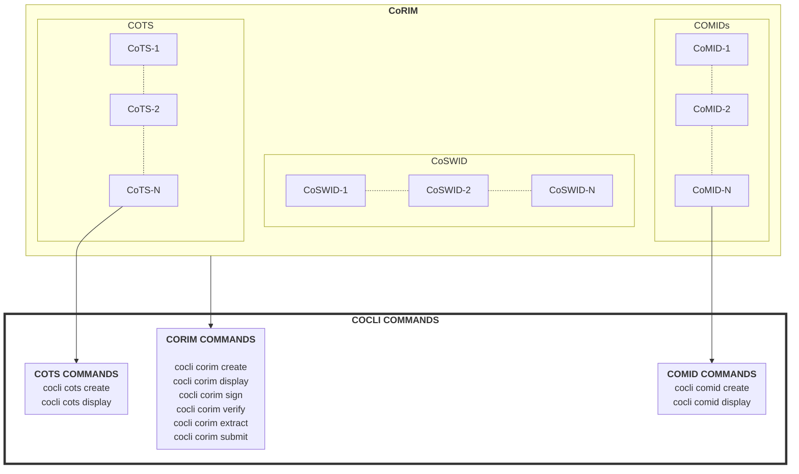
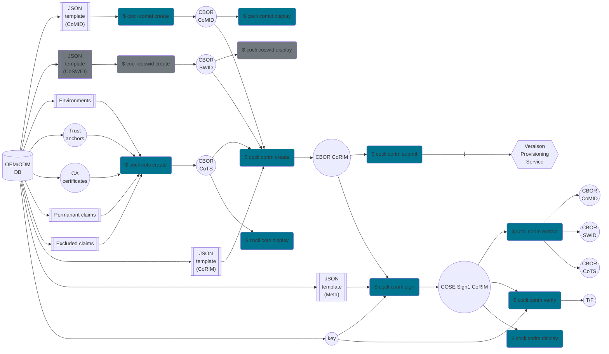

# Corim Command Line Interface

In this document we describe how to use Corim Command Line Interface tool `cocli` 

* [Installation](#installing-and-configuring)
* [Command Snapshot](#cocli-command-snapshot)
* [Supported Commands](#supported-commands)
  * [CoMID Commands](#comids-manipulation)
    * [Create](#create)
    * [Display](#display)
  * [CoTS Commands](#cotss-manipulation)
    * [Create](#create-1)
    * [Display](#display-1)
  * [CoRIM Commands](#corims-manipulation)
    * [Create](#create-2)
    * [Sign](#sign)
    * [Verify](#verify)
    * [Display](#display-2)
    * [Extract](#extract-coswids-comids-and-cotss)
  * [CoRIM Submission](#corim-submission-to-veraison)
    * [Remote Authentication](#remote-service-authentication)
  * [Command Synopsis](#visual-synopsis-of-the-available-commands)

# Installing and configuring

To install the `cocli` command, do:
```
$ go install github.com/veraison/corim/cocli@latest
```

To configure auto-completion, use the `completion` subcommand.  For example, if
`bash` is your shell, you would do something like:
```
$ cocli completion bash > ~/.bash_completion.d/cocli
$ . ~/.bash_completion
```
to get automatic command completion and suggestions using the TAB key.

To get a list of the supported shells, do:
```
$ cocli completion --help
```
# Cocli Command Snapshot
This document provides step-by-step instructions for how to use the `cocli` tool to manipulate CoRIMs, CoMIDs and CoTS.



# Supported Commands
This section describes all the available commands supported by `cocli` tool

## CoMIDs manipulation

The `comid` subcommand allows you to create, display and validate CoMIDs.

### Create

Use the `comid create` subcommand to create a CBOR-encoded CoMID, passing its
JSON representation via the `--template` switch (or equivalently its `-t` shorthand):

* Please inspect `comid` JSON templates as examples under `data/comid/templates` `comid-*.json`

```
$ cocli comid create --template data/comid/templates/comid-dice-refval.json
```
On success, you should see something like the following printed to stdout:
```
>> created "comid-dice-refval.cbor" from "comid-dice-refval.json"
```

The CBOR-encoded CoMID file is stored in the current working directory with a
name derived from its template.  If you want, you can specify a different
target directory using the `--output-dir` command line switch (abbrev. `-o`)
```
$ cocli comid create --template data/comid/templates/comid-dice-refval.json --output-dir /tmp
>> created "/tmp/comid-dice-refval.cbor" from "comid-dice-refval.json"
```
Note that the output directory, as well as all its parent directories, MUST
pre-exist.

You can also create multiple CoMIDs in one go.  Suppose all your templates are
stored in the `templates/` folder:
```
$ tree templates/
templates/
├── comid-dice-refval1.json
├── comid-dice-refval2.json
...
└── comid-dice-refvaln.json
```
Then, you can use the `--template-dir` (abbrev. `-T`), and let the tool load,
validate, and CBOR-encode the templates one by one:
```
$ cocli comid create --template-dir templates
>> created "comid-dice-refval1.cbor" from "templates/comid-dice-refval1.json"
>> created "comid-dice-refval2.cbor" from "templates/comid-dice-refval2.json"
...
>> created "comid-dice-refvaln.cbor" from "templates/comid-dice-refvaln.json"
```

You can specify both the `-T` and `-t` switches as many times as needed, and
even combine them in one invocation:
```
$ cocli comid create -T comid-templates/ \
                   -T comid-templates-aux/ \
                   -t extra-comid.json \
                   -t yet-another-comid.json \
                   -o /var/spool/comid
```

**NOTE** that since the output file name is deterministically generated from the
template file name, all the template files (when from different directories)
MUST have different base names.


### Display

Use the `comid display` subcommand to print to stdout one or more CBOR-encoded
CoMIDs in human readable (JSON) format.

You can supply individual files using the `--file` switch (abbrev. `-f`), or
directories that may (or may not) contain CoMID files using the `--dir` switch
(abbrev. `-d`).  Only valid CoMIDs will be displayed, and any decoding or
validation error will be printed alongside the corresponding file name.

For example:
```
$ cocli comid display --file data/comid/comid-dice-refval.cbor
```
provided the `comid-dice-refval.cbor` file contains valid CoMID, would print something like:
```
>> [comid-dice-refval.cbor]
{
  "tag-identity": {
    "id": "1d5a8c7c-1c70-4c56-937e-3c5713ae5a83"
  },
  "triples": {}
[...]
}
```
While a `data/comid/` folder with the following contents:
```
$ tree data/comid/
data/comid/
├── rubbish.cbor
├── 1.cbor
└── 2.cbor
```
could be inspected in one go using:
```
$ cocli comid display --dir data/comid/
```
which would output something like:
```
>> failed displaying "comids.d/rubbish.cbor": CBOR decoding failed: EOF
>> [data/comid/1.cbor]
{
  "tag-identity": {
    "id": "43bbe37f-2e61-4b33-aed3-53cff1428b16"
  },
[...]
}
>> [data/comid/2.cbor]
{
  "tag-identity": {
    "id": "366d0a0a-5988-45ed-8488-2f2a544f6242"
  },
[...]
}
Error: 1/3 display(s) failed
```

One or more files and directories can be supplied in the same invocation, e.g.:
```
$ cocli comid display -f m1.cbor \
                    -f comids.d/m2.cbor \
                    -d /var/spool/comids \
                    -d yet-another-comid-folder/
```

## CoTSs manipulation
The `cots` subcommand allows you to create, display and validate CoTSs.

### Create

Use the `cots create` subcommand to create a CBOR-encoded CoTS. The `environment` switch takes in a JSON template specifiying the environments that are valid for the keys specified and the `tas` switch takes in a directory of trust anchors files:

* Please inspect `data/cots/templates` JSON templates as examples for `environment` and `claims`


```
$ cocli cots create --environment data/cots/env/vendor.json --tafile data/cots/shared_ta.ta
```
On success, you should see something like the following printed to stdout:
```
>> created "vendor.cbor"
```

The CBOR-encoded CoTS file is stored in the current working directory with a
name derived from its environment template.  If you want, you can specify a different
target directory and file name using the `--output` command line switch (abbrev. `-o`)
```
$ cocli cots create --environment data/cots/env/vendor.json --tafile data/cots/shared_ta.ta --output /tmp/myCots.cbor
>> created "/tmp/myCots.cbor"
```
Note that the output directory, as well as all its parent directories, MUST pre-exist.

### Display

Use the `cots display` subcommand to print to stdout one or more CBOR-encoded
CoTSs in human readable (JSON) format.

You can supply individual files using the `--file` switch (abbrev. `-f`), or
directories that may (or may not) contain CoTS files using the `--dir` switch
(abbrev. `-d`).  Only valid CoTSs will be displayed, and any decoding or
validation error will be printed alongside the corresponding file name.

For example:
```
$ cocli cots display --file vendor.cbor
```
provided the `vendor.cbor` file contains valid CoTS, would print something like:
```
>> [vendor.cbor]
{
  "environments": [
    {
      "environment": {
        "class": {
          "vendor": "Zesty Hands, Inc."
        }
      }
    }
  ],
  "keys": {
    "tas": [
      {
        "format": 1,
        "data": "ooICejCCAnYwWTATBgcqhkjOPQIBBggqhkjOPQMBBwNCAATjUaoQOSQHpL0DfKC8EVTQ5wHwZ085yyxPkhBpLOu+7B0nl33FYWV1Hg4je/37FTbpmohFkUKWYd81z8C/K1DMBBQBXEXJrLBGKnFd1xCgeMAVSfEBPzCCAgEwPjELMAkGA1UEBgwCVVMxEDAOBgNVBAoMB0V4YW1wbGUxHTAbBgNVBAMMFEV4YW1wbGUgVHJ1c3QgQW5jaG9yoIIBvTCCAWSgAwIBAgIVANCdkL89UlzHc9Ui7XfVniK7pFuIMAoGCCqGSM49BAMCMD4xCzAJBgNVBAYMAlVTMRAwDgYDVQQKDAdFeGFtcGxlMR0wGwYDVQQDDBRFeGFtcGxlIFRydXN0IEFuY2hvcjAeFw0yMjA1MTkxNTEzMDdaFw0zMjA1MTYxNTEzMDdaMD4xCzAJBgNVBAYMAlVTMRAwDgYDVQQKDAdFeGFtcGxlMR0wGwYDVQQDDBRFeGFtcGxlIFRydXN0IEFuY2hvcjBZMBMGByqGSM49AgEGCCqGSM49AwEHA0IABONRqhA5JAekvQN8oLwRVNDnAfBnTznLLE+SEGks677sHSeXfcVhZXUeDiN7/fsVNumaiEWRQpZh3zXPwL8rUMyjPzA9MB0GA1UdDgQWBBQBXEXJrLBGKnFd1xCgeMAVSfEBPzALBgNVHQ8EBAMCAoQwDwYDVR0TAQH/BAUwAwEB/zAKBggqhkjOPQQDAgNHADBEAiALBidABsfpzG0lTL9Eh9b6AUbqnzF+koEZbgvppvvt9QIgVoE+bhEN0j6wSPzePjLrEdD+PEgyjHJ5rbA11SPq/1M="
      }
    ]
  }
}

```
While a `data/cots` folder with the following contents:
```
$ tree cots/
cots/
├── rubbish.cbor
├── namedtastore.cbor
├── vendor.cbor
```
could be inspected in one go using:
```
$ cocli cots display --dir data/cots/
```
which would output something like:
```
>> [data/cots/namedtastore.cbor]
{
  "environments": [
    {
      "namedtastore": "Miscellaneous TA Store"
    }
  ],
  "keys": {
    "tas": [
      {
        "format": 1,
        "data": "ooIC1TCCAtEwWTATBgcqhkjOPQIBBggqhkjOPQMBBwNCAATN0f5kzywEzZOYbaV23O3N8cku39JoLNjlHPwECbXDDWp0LpAO1z248/hoy6UW/TZMTPPR/93XwHsG16mSFy8XBBSKhM/5gJWjvDbW7qUY1peNm9cfYDCCAlwwXDELMAkGA1UEBgwCVVMxHzAdBgNVBAoMFlNub2JiaXNoIEFwcGFyZWwsIEluYy4xLDAqBgNVBAMMI1Nub2JiaXNoIEFwcGFyZWwsIEluYy4gVHJ1c3QgQW5jaG9yoIIB+jCCAZ+gAwIBAgIUEBuTRGXAEEVEHhu4xafAnqm+qYgwCgYIKoZIzj0EAwIwXDELMAkGA1UEBgwCVVMxHzAdBgNVBAoMFlNub2JiaXNoIEFwcGFyZWwsIEluYy4xLDAqBgNVBAMMI1Nub2JiaXNoIEFwcGFyZWwsIEluYy4gVHJ1c3QgQW5jaG9yMB4XDTIyMDUxOTE1MTMwOFoXDTMyMDUxNjE1MTMwOFowXDELMAkGA1UEBgwCVVMxHzAdBgNVBAoMFlNub2JiaXNoIEFwcGFyZWwsIEluYy4xLDAqBgNVBAMMI1Nub2JiaXNoIEFwcGFyZWwsIEluYy4gVHJ1c3QgQW5jaG9yMFkwEwYHKoZIzj0CAQYIKoZIzj0DAQcDQgAEzdH+ZM8sBM2TmG2ldtztzfHJLt/SaCzY5Rz8BAm1ww1qdC6QDtc9uPP4aMulFv02TEzz0f/d18B7BtepkhcvF6M/MD0wHQYDVR0OBBYEFIqEz/mAlaO8NtbupRjWl42b1x9gMAsGA1UdDwQEAwIChDAPBgNVHRMBAf8EBTADAQH/MAoGCCqGSM49BAMCA0kAMEYCIQC2cf43f3PPlCO6/dxv40ftIgxxToKHF72UzENv7+y4ygIhAIGtC/r6SGaFMaP7zD2EloBuIXTtyWu8Hwl+YGdXRY93"
      }
    ]
  }
}
>> failed displaying "data/cots/rubbish.cbor": CBOR decoding failed: cbor: cannot unmarshal primitives into Go value of type cots.ConciseTaStore
>> [data/cots/vendor.cbor]
{
  "environments": [
    {
      "environment": {
        "class": {
          "vendor": "Zesty Hands, Inc."
        }
      }
    }
  ],
  "keys": {
    "tas": [
      {
        "format": 1,
        "data": "ooICejCCAnYwWTATBgcqhkjOPQIBBggqhkjOPQMBBwNCAATjUaoQOSQHpL0DfKC8EVTQ5wHwZ085yyxPkhBpLOu+7B0nl33FYWV1Hg4je/37FTbpmohFkUKWYd81z8C/K1DMBBQBXEXJrLBGKnFd1xCgeMAVSfEBPzCCAgEwPjELMAkGA1UEBgwCVVMxEDAOBgNVBAoMB0V4YW1wbGUxHTAbBgNVBAMMFEV4YW1wbGUgVHJ1c3QgQW5jaG9yoIIBvTCCAWSgAwIBAgIVANCdkL89UlzHc9Ui7XfVniK7pFuIMAoGCCqGSM49BAMCMD4xCzAJBgNVBAYMAlVTMRAwDgYDVQQKDAdFeGFtcGxlMR0wGwYDVQQDDBRFeGFtcGxlIFRydXN0IEFuY2hvcjAeFw0yMjA1MTkxNTEzMDdaFw0zMjA1MTYxNTEzMDdaMD4xCzAJBgNVBAYMAlVTMRAwDgYDVQQKDAdFeGFtcGxlMR0wGwYDVQQDDBRFeGFtcGxlIFRydXN0IEFuY2hvcjBZMBMGByqGSM49AgEGCCqGSM49AwEHA0IABONRqhA5JAekvQN8oLwRVNDnAfBnTznLLE+SEGks677sHSeXfcVhZXUeDiN7/fsVNumaiEWRQpZh3zXPwL8rUMyjPzA9MB0GA1UdDgQWBBQBXEXJrLBGKnFd1xCgeMAVSfEBPzALBgNVHQ8EBAMCAoQwDwYDVR0TAQH/BAUwAwEB/zAKBggqhkjOPQQDAgNHADBEAiALBidABsfpzG0lTL9Eh9b6AUbqnzF+koEZbgvppvvt9QIgVoE+bhEN0j6wSPzePjLrEdD+PEgyjHJ5rbA11SPq/1M="
      }
    ]
  }
}

Note: One of more files and directories can be supplied in the same invocation, using -f and -d directive:

```

## CoSWID manipulation

Tooling to manipulate `CoSWID` is not currently available under Project Veraison.
However CoSWID can be part of CoRIM by constructing CoSWID CBOR by other indistry available
tools such as [swid-tools](https://github.com/usnistgov/swid-tools) and including them
as mentioned under [CORIM Construction](CORIM.md)

## CoRIMs manipulation

The `corim` subcommand allows you to create, display, sign, verify CoRIMs or submit
a CoRIM using the [Veraison provisioning API](https://github.com/veraison/docs/tree/main/api/endorsement-provisioning).
It also provides a means to extract as-is the embedded CoSWIDs, CoMIDs and CoTSs and save
them as separate files.

### Create

Use the `corim create` subcommand to create a CBOR-encoded, unsigned CoRIM, by
passing its JSON representation via the `--template` switch (or equivalently its `-t` shorthand)
together with the CBOR-encoded CoMIDs, CoSWIDs and/or CoTS to be embedded.

* Please inspect `corim` JSON templates as examples under `data/corim/templates` `corim-*.json`

```
$ cocli corim create --template data/corim/templates/corim-full.json --comid data/comid/comid-dice-refval.cbor --coswid data/coswid/1.cbor --cots data/cots/vendor.cbor
```
On success, you should see something like the following printed to stdout:
```
>> created "corim-full.cbor" from "corim-full.json"
```

The CBOR-encoded CoRIM file is stored in the current working directory with a
name derived from its template.  If you want, you can specify a different
file name using the `--output` command line switch (abbrev. `-o`):
```
$ cocli corim create -t data/corim/templates/corim-full.json -m data/comid/comid-dice-refval.cbor -s data/coswid/1.cbor -c data/cots/c1.cbor -o unsigned-corim.cbor
>> created "unsigned-corim.cbor" from "corim-full.json"
```

CoMIDs, CoSWIDs and CoTSs can be either supplied as individual files, using the
`--comid` (abbrev. `-m`), `--coswid` (abbrev. `-s`) and `--cots` (abbrev. `-c`) switches respectively, or
as "per-folder" blocks using the `--comid-dir` (abbrev. `-M`), `--coswid-dir` and `--cots-dir`
(abbrev. `-C`) switch.  For example:
```
$ cocli corim create --template data/corim/templates/corim-full.json --comid-dir data/comid/cbor/
```

Creation will fail if *any* of the inputs is non conformant.  For example, if
`data/comid/cbor/` contains an invalid CoMID file `rubbish.cbor`, an attempt to create a
CoRIM:
```
$ cocli corim create -t data/corim/templates/corim-full.json -M data/comid/cbor/
```
will fail with:
```
Error: error loading CoMID from data/comid/cbor/rubbish.cbor: EOF
```

### Sign

Use the `corim sign` subcommand to cryptographically seal the unsigned CoRIM
supplied via the `--file` switch (abbrev. `-f`).  The signature is produced
using the key supplied via the `--key` switch (abbrev. `-k`), which is expected
to be in [JWK](https://www.rfc-editor.org/rfc/rfc7517) format.  On success, the
resulting COSE Sign1 payload is saved to file whose name can be controlled using
the `--output` switch (abbrev. `-o`).  A CoRIM Meta template in JSON format must 
also be provided using the `--meta` switch (abbrev.`-m`).

* Please inspect the `data/corim/templates` directory for `meta` JSON templates.

For example, with the default output file:
```
$ cocli corim sign --file corim.cbor --key ec-p256.jwk --meta meta.json
>> "corim.cbor" signed and saved to "signed-corim.cbor"
```
Or, the same but with a custom output file:
```
$ cocli corim sign --file data/corim/corim-full.cbor \
                 --key data/keys/ec-p256.jwk \
                 --meta data/corim/templates/meta-full.json \
                 --output /var/spool/signed-corim.cbor
>> "corim-full.cbor" signed and saved to "/var/spool/signed-corim.cbor"
```

### Verify

Use the `corim verify` subcommand to cryptographically verify the signed CoRIM
supplied via the `--file` switch (abbrev. `-f`).  The signature is checked
using the key supplied via the `--key` switch (abbrev. `-k`), which is expected
to be in [JWK](https://www.rfc-editor.org/rfc/rfc7517) format.  For example:
```
$ cocli corim verify --file data/corim/signed-corim.cbor --key data/keys/ec-p256.jwk
>> "signed-corim.cbor" verified
```

Verification can fail either because the cryptographic processing fails or
because the signed payload or protected headers are themselves invalid.  For example:
```
$ cocli corim verify --file data/corim/signed-corim-bad-signature.cbor --key data/keys/ec-p256.jwk
```
will give
```
Error: error verifying signed-corim-bad-signature.cbor with key ec-p256.jwk: verification failed ecdsa.Verify
```

### Display

Use the `corim display` subcommand to print to stdout a signed CoRIM in human
readable (JSON) format.

You must supply the file you want to display using the `--file` switch (abbrev.
`-f`).  Only a valid CoRIM will be displayed, and any occurring decoding or
validation errors will be printed instead.

The output has two logical sections: one for Meta and one for the (unsigned)
CoRIM:
```
$ cocli corim display --file data/corim/signed-corim.cbor
Meta:
{
  "signer": {
    "name": "ACME Ltd signing key",
    "uri": "https://acme.example/signing-key.pub"
  },
[...]
}
Corim:
{
  "corim-id": "5c57e8f4-46cd-421b-91c9-08cf93e13cfc",
  "tags": [
    "2QH...",
[...]
  ]
}
```

By default, the embedded CoMID, CoSWID and CoTS tags are not expanded, and what you
will see is the base64 encoding of their CBOR serialisation.  If you want to
peek at the tags' content, supply the `--show-tags` (abbrev. `-v`) switch, which
will add a further Tags section with one entry per each expanded tag:
```
$ cocli corim display --file data/corim/signed-corim.cbor --show-tags
Meta:
{
[...]
}
Corim:
{
[...]
}
Tags:
>> [ 0 ]
{
  "tag-identity": {
    "id": "366d0a0a-5988-45ed-8488-2f2a544f6242"
  },
[...]
}
>> [ 1 ]
{
  "tag-identity": {
    "id": "43bbe37f-2e61-4b33-aed3-53cff1428b16"
  },
[...]
}
>> [ 2 ]
{
  "tag-id": "com.acme.rrd2013-ce-sp1-v4-1-5-0",
[...]
}
```

### Extract CoSWIDs, CoMIDs and CoTSs

Use the `corim extract` subcommand to extract the embedded CoMIDs, CoSWIDs and CoTSs
from a signed CoRIM.

You must supply a signed CoRIM file using the `--file` switch (abbrev. `-f`) and
an optional output folder (default is the current working directory) using the
`--output-dir` switch (abbrev. `-o`).  Make sure that the output directory as
well as any parent folder exists prior to issuing the command.

On success, the found CoMIDs, CoSWIDs, CoTS are saved in CBOR format:
```
$ cocli corim extract --file data/corim/signed-corim.cbor --output-dir output.d/
$ tree output.d/
output.d/
├── 000000-comid.cbor
├── 000001-comid.cbor
├── 000002-coswid.cbor
└── 000003-cots.cbor
```

## CoRIM Submission to Veraison

Use the `corim submit` subcommand to upload a CoRIM using the Veraison provisioning API.
The CoRIM file containing the CoRIM data in CBOR format is supplied via the
`--corim-file` switch (abbrev. `-f`). The server URL where to upload the CoRIM
payload is supplied via the `--api-server` switch (abbrev. `-s`).
Further, it is required to supply the media type of the content via the
`--media-type` switch (abbrev. `-m`)
```
$ cocli corim submit \
    --corim-file data/corim/unsigned-corim.cbor \
    --api-server "https://veraison.example/endorsement-provisioning/v1/submit" \
    --media-type "application/corim-unsigned+cbor; profile=http://arm.com/psa/iot/1"

>> "unsigned-corim.cbor" submit ok
```

#### Remote Service Authentication

The above will work if the remote service does not authenticate
endorsement-provisioning API calls. If the service does authenticate, then
cocli must be configured appropriately. This can be done using a `config.yaml`
file located in the current working directory, or in the standard config
path (usually `~/.config/cocli/config.yaml` on XDG-compliant systems). Please
see `./data/config/example-config.yaml` file for details of the configuration
that needs to be provided.

## Visual Synopsis of the Available Commands


