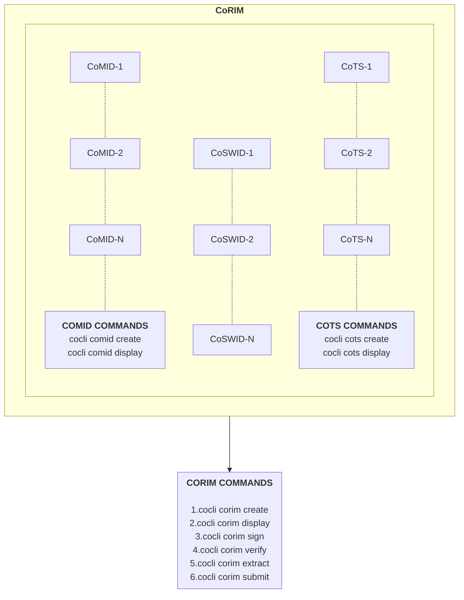
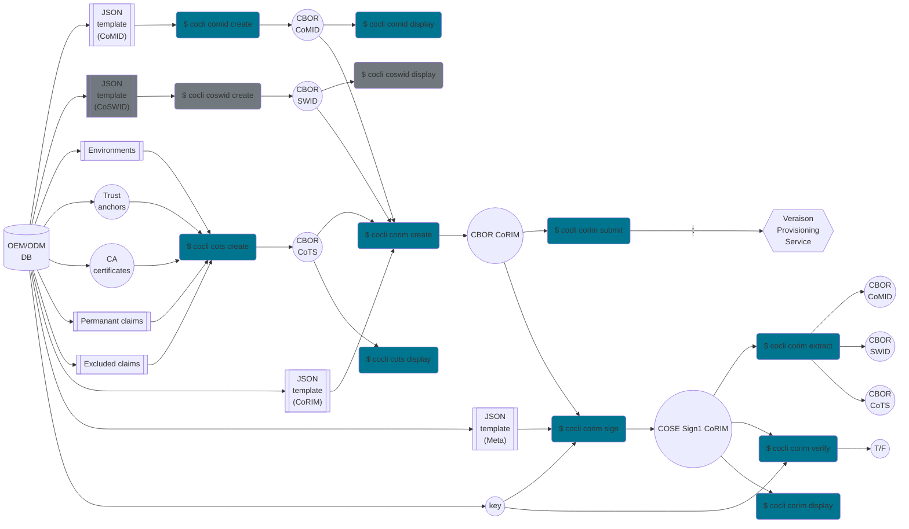

# Corim Command Line Interface

## Installing and configuring

To install the `cocli` command, do:
```
$ go install github.com/veraison/corim/cocli@latest
```

To configure auto-completion, use the `completion` subcommand.  For example, if
`bash` is your shell, you would do something like:
```
$ cocli completion bash > ~/.bash_completion.d/cocli
$ . ~/.bash_completion
```
to get automatic command completion and suggestions using the TAB key.

To get a list of the supported shells, do:
```
$ cocli completion --help
```
# CoRIM Handling
This document provides step-by-step instructions for how to use the `cocli` tool to manipulate CoRIMs, CoMIDs and CoTS.



## CoMIDs manipulation
The instructions to manipulate CoMIDs are documented [here](COMID.md)

## CoTSs manipulation
The instructions to manipulate CoTSs are documented [here](COTS.md)

## CoSWID manipulation
Tooling to manipulate `CoSWID` is not currently available under Project Veraison.
However CoSWID can be part of CoRIM by constructing CoSWID CBOR by other indistry available
tools such as [swid-tools](https://github.com/usnistgov/swid-tools) and including them
as mentioned under [CORIM Construction](CORIM.md)

## CoRIMs manipulation
The instructions to manipulate CoRIMs are documented [here](CORIM.md)

## CoRIM Submission to Veraison

Use the `corim submit` subcommand to upload a CoRIM using the Veraison provisioning API.
The CoRIM file containing the CoRIM data in CBOR format is supplied via the
`--corim-file` switch (abbrev. `-f`). The server URL where to upload the CoRIM
payload is supplied via the `--api-server` switch (abbrev. `-s`).
Further, it is required to supply the media type of the content via the
`--media-type` switch (abbrev. `-m`)
```
$ cocli corim submit \
    --corim-file data/corim/unsigned-corim.cbor \
    --api-server "https://veraison.example/endorsement-provisioning/v1/submit" \
    --media-type "application/corim-unsigned+cbor; profile=http://arm.com/psa/iot/1"

>> "unsigned-corim.cbor" submit ok
```

#### Remote Service Authentication

The above will work if the remote service does not authenticate
endorsement-provisioning API calls. If the service does authenticate, then
cocli must be configured appropriately. This can be done using a `config.yaml`
file located in the current working directory, or in the standard config
path (usually `~/.config/cocli/config.yaml` on XDG-compliant systems). Please
see `./data/config/example-config.yaml` file for details of the configuration
that needs to be provided.

## Visual Synopsis of the Available Commands


